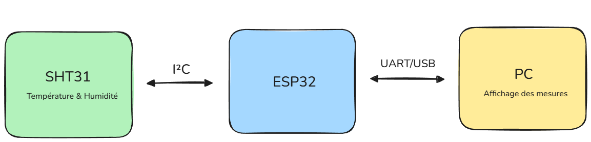

# Thermomètre / Hygromètre pour fourmilière

## Objectif
Mesurer la température et l’humidité près de ma fourmilière.

## Technologies envisagées
- ESP32
- Capteur SHT31 ou BME280
- Affichage des mesures sur le PC via USB

## Contraintes
- Budget faible
- Pas de soudure au début
- Projet évolutif
- Documentation claire pour portfolio

## Évolutions possibles
- Écran OLED
- Alertes
- Historique des mesures
- Wi-Fi
- PCB personnalisé
- Boîtier
 
 

# Cahier des charges V1
  ## Produit final
  - Un thermomètre-hygromètre embarqué pour le suivi de l'environnement dans ma pièce d'élevage, capable de mesurer température et humidité près du nid, d’afficher les valeurs localement, et éventuellement d’envoyer les données à un PC.
    Le système devra :
      - mesurer la température
      - mesurer l'humidité
      - afficher les valeurs localement
      - transmettre les données au PC
      - être évolutif vers une version connectée.

  ## Emplacement
  - Capteur placé proche de l’aire de vie ou du nid, mais sans contact direct avec les fourmis ni l’humidité liquide.

  ## Alimentation
  - Pour la V1 : USB 5 V

  ## Affichage
  V1: UART sur PC.
  V2: Ecran OLED I²C.

  ## Historique des données
  -V1: Envoi des mesures en UART sur PC
  -V2: Envoi sans fil

  ## Wi-Fi
  - V1: USB
  - V2: Wi-Fi via ESP32. Consultation des mesures à distance.

  ## Carte
  - V1: breadboard/proto
  - V2: schéma + PCB

  ## Architecture V1
  
